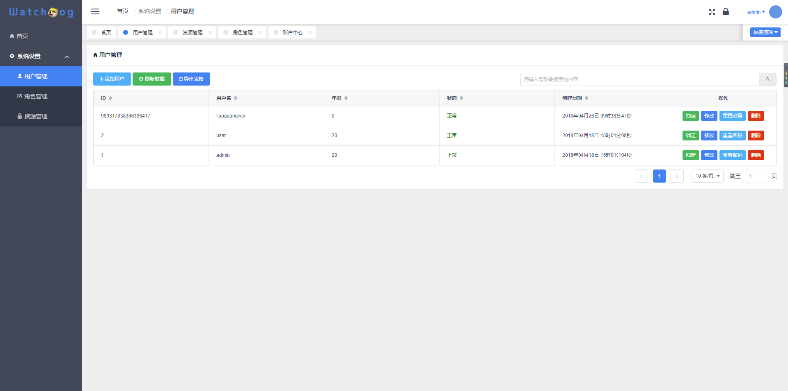
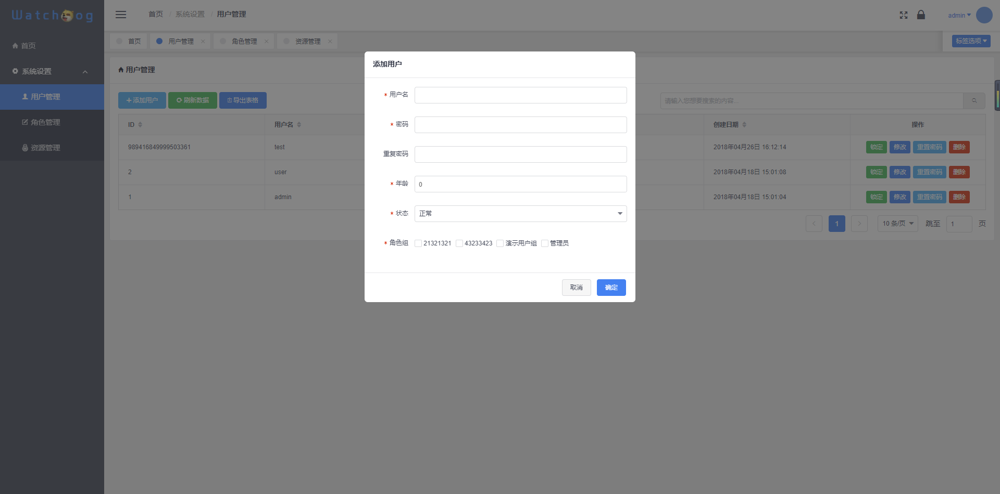
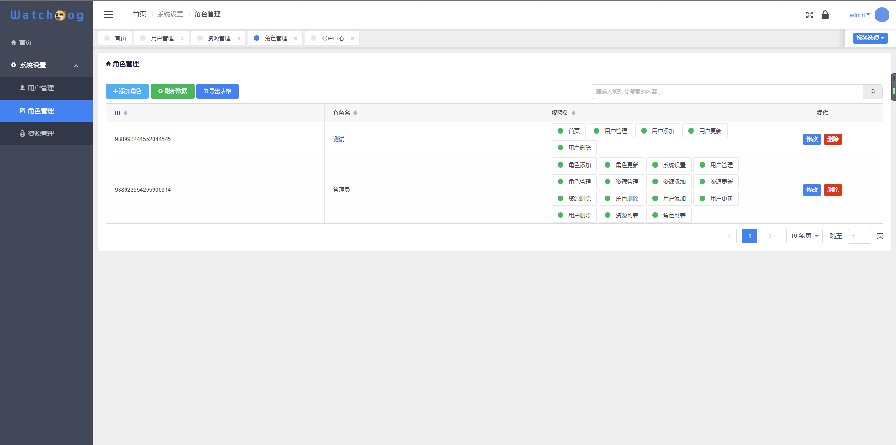
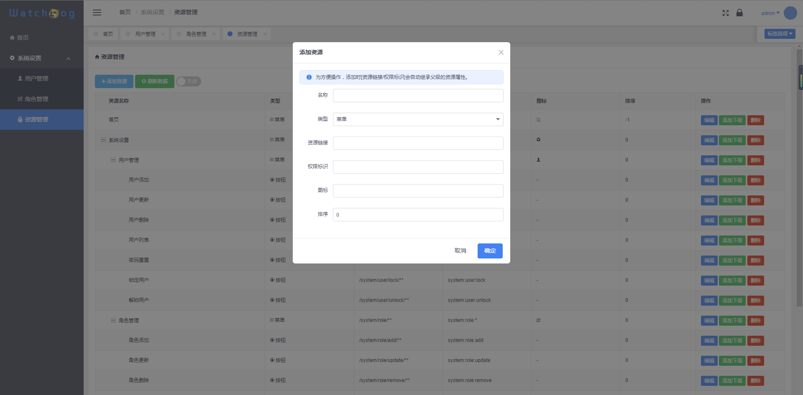

# 介绍
`watchdog-framework`基于SpringBoot+Shiro+Mybatis+Mybatis-Plus+HikariCP+Redis+Vue+iView等开发的轻量级管理系统快速开发脚手架，拥有角色、用户、资源管理、权限数据同步更新等功能，并此项目会进行持续更新升级，欢迎使用，若对您有帮助请点击上方的star :beers: 。
# 在线演示

[https://wdog-web.licoy.cn](https://wdog-web.licoy.cn)

- 用户名：test
- 密码：test123456

# 部分界面展示
## 登录

## 用户管理

## 用户管理

## 用户添加
 
## 角色管理
 
## 角色添加
 
## 资源管理
 
## 资源添加
    
## 更多请查看上方演示
# 技术选型
## 后端技术
技术 | 类型 | 版本 | 官网
----|------|----|----
Spring Boot | 容器 | 1.5.12.RELEASE | [http://start.spring.io/](http://start.spring.io/)
Mybatis-Starter | ORM框架 | 1.3.1 |  [http://www.mybatis.org](http://www.mybatis.org)
Mybatis-Plus | ORM框架 | 1.3.1 |  [http://mp.baomidou.com/](http://mp.baomidou.com/)
Maven | 项目构建管理 | 3.6 |  [http://maven.apache.org](http://maven.apache.org/)
Apache Shiro | 安全框架 | 1.3.2 |  [http://shiro.apache.org](http://www.mybatis.org/generator/index.html)
Lombok | 工具 | 1.16.20 |  [https://www.projectlombok.org/](https://www.projectlombok.org/)
HikariCP | 数据库连接池 | 2.7.8 |  [http://brettwooldridge.github.io/HikariCP/](http://brettwooldridge.github.io/HikariCP/)
Shiro-Redis | shiro缓存工具 | 2.8.24 | [https://github.com/alexxiyang/shiro-redis](https://github.com/alexxiyang/shiro-redis)
Springfox-Swagger2 | api文档工具 | 2.7.0 | [https://github.com/springfox/springfox](https://github.com/springfox/springfox)
jedis | redis管理 | 2.9.0 | [https://github.com/xetorthio/jedis](https://github.com/xetorthio/jedis)
jwt | 身份认证 | 3.2.0 | [https://jwt.io/](https://jwt.io/)
## 前端技术
技术 | 类型 | 版本 | 官网
----|------|----|----
Vue | 前端渐进式框架 | 2.5.13 | [https://cn.vuejs.org/](https://cn.vuejs.org/)
Vue-Router | 前端路由 | 3.0.1 | [https://router.vuejs.org/](https://router.vuejs.org/)
Vuex | 前端状态管理 | 3.0.1 | [https://vuex.vuejs.org/](https://vuex.vuejs.org/)
Axios | HTTP库 | 0.18.0 | [https://github.com/axios/axios](https://github.com/axios/axios)
iView | UI框架 | 2.8.0 | [https://www.iviewui.com/](https://www.iviewui.com/)
dayjs | JS时间操作库 | 1.5.14 | [https://github.com/xx45/dayjs](https://github.com/xx45/dayjs)
String-Format | 字符串格式化 | 1.0.0 | [https://github.com/davidchambers/string-format](https://github.com/davidchambers/string-format)
Vue-table-with-tree-grid | iview-树表格 | 0.2.4 | [https://github.com/MisterTaki/vue-table-with-tree-grid](https://github.com/MisterTaki/vue-table-with-tree-grid)
js-md5 | js-md5库 | 0.7.3 | [https://github.com/emn178/js-md5](https://github.com/emn178/js-md5)

# 使用方法
## 软件需求
    JDK1.8+
    MySQL5.6+
    Maven4.0+
## 服务端
- 使用前提：安装lombok插件
   
   - IDEA安装方法：[https://blog.csdn.net/zhglance/article/details/54931430](https://blog.csdn.net/zhglance/article/details/54931430)
   - eclipse安装方法：[https://blog.csdn.net/dorothy1224/article/details/79280591/](https://blog.csdn.net/dorothy1224/article/details/79280591/)
- 克隆到本地
```git
git clone git@github.com:watchdog-framework/watchdog-framework.git
```
- 导入SQL

    将项目根目录下的`wdog.sql`导入至数据库信息
    > admin默认密码为：123456
- 修改数据库信息
```yml
# application.yml
spring:
  datasource:
    url: jdbc:mysql://localhost:3306/wdog?useUnicode=yes&characterEncoding=UTF8
    password: root
    username: root
    driver-class-name: com.mysql.jdbc.Driver
```
- 启动
    
    运行`WatchDogApplication.java`，默认端口为1000
    
 ## 客户端

- [点击此处进入“watchdog-framework-web”项目部署说明](https://github.com/watchdog-framework/watchdog-framework-web)

# 常见问题
- [点此查看解决办法](QUESTION.md)

# 讨论

 - QQ群：30261540  &nbsp; [点我加入QQ群讨论](https://shang.qq.com/wpa/qunwpa?idkey=c3541f1d0dbe443456228e3aebf23f6795b614a94d5df6a32f0b2b1c759bb99b)

- 作者博客：[https://www.licoy.cn](https://www.licoy.cn)

# 项目地址

- Github：[https://github.com/watchdog-framework/watchdog-framework](https://github.com/watchdog-framework/watchdog-framework)

- 码云：[https://gitee.com/licoy/watchdog-framework](https://gitee.com/licoy/watchdog-framework)

# TODO

- [ ] 支持容器化
- [ ] 字典
- [x] 日志记录
- [ ] More...

# 业务扩展

个人接单，有需求的小伙伴可以直接联系我，业务类型请参考：[https://www.licoy.cn/business.html](https://www.licoy.cn/business.html)

# 开源协议
MIT
    
